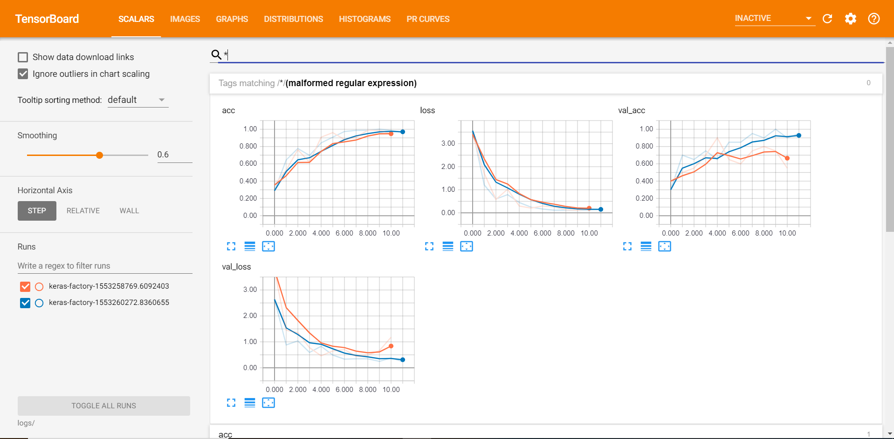
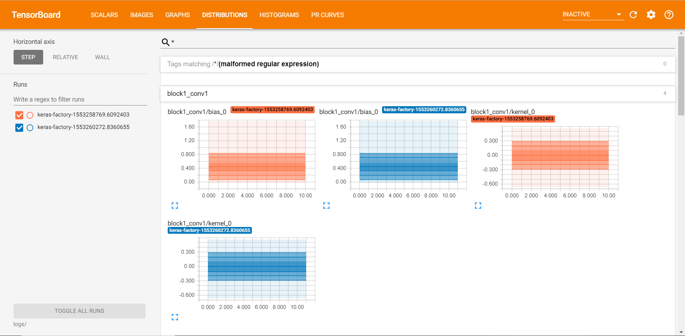
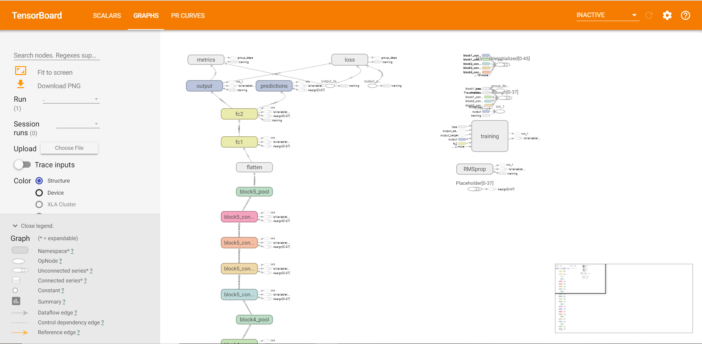
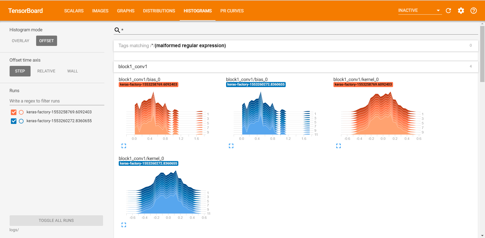
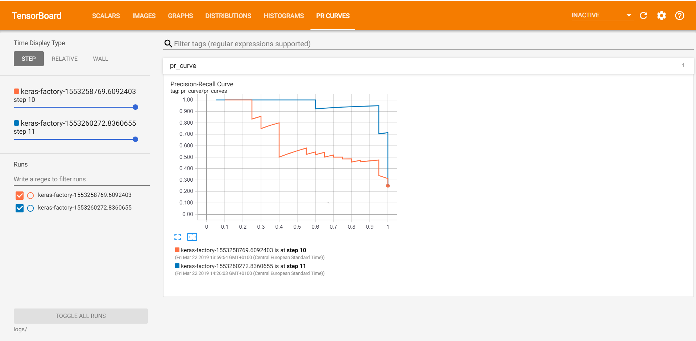

Keras Factory
===============

Este proyecto, Keras-Factory trata de utilizar de manera facil y estructurada los modelos disponibles ya en Keras. Se penso para que cualquiera tuviera una biblioteca de aprendizaje profundo de Keras disponibles y de facil uso. Proporciona definiciones de modelos y pesos pre-entrenados para una serie de arquitecturas populares, como VGG16, ResNet50, Xception, Inception y más.

Entorno Virtual
===============

Para crear el entorno virtual, tenemos que tener anaconda previamente instalado en nuestro equipo.

1. [Descargar anaconda](https://www.anaconda.com/download/)

Crear el entorno virtual utilizando el fichero *environment.yml* (contiene todas las dependencias de paquetes de conda y pip)

`conda env create --file environment.yml`

Para activar el entorno creado

`activate keras-factory`

Para desactivar el entorno actual

`deactivate keras-factory`

Para actualizar el entorno con nuevas dependencias (el entorno actual tiene que estar desactivado)

`conda env update --file environment.yml`

Análisis de ficheros
===============

Para iniciar un entrenamiento:

`python train.py`

Para realizar un test del modelo:

`python test.py`

Crear dos carpetas(source/logs y source/models) para el almacenamiento de los logs de tensorboard y de los modelos.

Análisis de fichero configuración
===============

Se tendra que manejar la configuración de la red con la que queremos entrenar. El fichero de configuración es "network_config.json". Los campos son:

1. name -> Nombre del modelo de Keras a utilizar (Disponibles InceptionResNetV2, InceptionV3, ResNet50, VGG19, Densenet(121,169,201)).

2. model_save_path -> Directorio donde guardar el modelo entrenado al final del proceso.

3. dropout -> Configuración del dropout(Técnica para la deserción aleatoria de neuronas, las neuronas seleccionadas al azar se ignoran durante el entrenamiento). Parametro esperado puede ser un porcentaje, por ejemplo 0.2, 0.1... (20% 0 10%)

4. activation -> Se utiliza para asignar la salida de una capa a otra. Hay varios tipos de activaciones que podremos utilziar en Keras:
    - Softmax. La utilizada en la VGG19 de Sener. La principal ventaja de usar Softmax es el rango de probabilidades de salida. El rango será de 0 a 1, y la suma de todas las probabilidades será igual a uno.
    - Elu
    - Selu
    - Softplus
    - Relu
    - tanh
    - sigmoid
    - hard-sigmoid
    - exponential
    - linear

5. epochs -> Cuántas veces pasa el entrenemiento de la red por tu conjunto de entrenamiento

6. batch_size -> El "batch size", es el conjunto de muestras (por ejemplo 1-32) del conjunto de datos de entrenamiento (por ejemplo 96) y entrena a la red. A continuación, toma las segundas 32 muestras (de 32 a 64) y vuelve a entrenar la red. Podemos seguir haciendo este procedimiento hasta que nos hayamos propagado a través de todas las muestras de la red.

7. verbose -> Al configurar verbose 0, 1 o 2, simplemente configuramos cómo queremos "ver" el progreso del entrenamiento para cada época.

    - verbose = 0. No te mostrará nada.

    - verbose = 1. Te mostrará una barra de progreso animada.

    - verbose = 2. Solo mencionara el numero de época.

8. loss_type -> mean_squared_error, mean_absolute_error, mean_absolute_percentage_error, mean_squared_logarithmic_error, squared_hinge
hinge, categorical_hinge, logcosh, categorical_crossentropy, sparse_categorical_crossentropy, binary_crossentropy, kullback_leibler_divergence, poisson, cosine_proximity.

9. optimizer -> SGD, RMSprop, Adagrad, Adadelta, Adam, Adamax, Nadam
10. metrics
11. include_top -> True / False. Importante para el fine-tuning de los modelos, especificamente en casos de transfer learning.

El tamaño de entrada utilizado 224x224 para todos los modelos, excepto InceptionV3 (299x299), InceptionResNetV2 (299x299) y Xception (299x299).

Visualización en tensorboard
===============
Para poder visualizar nuestro board, tendremos que introducir en un cmd el siguiente comando una vez ejecutado el script de train.py:

`tensorboard --log_dir=/logs`

Esto nos abrira un portal en la dirección localhost:6006 donde podreis visualizar los componentes desarrollados.

Se ha realizado una funcion generica "VisualizeTensorBoard" para ahi construir, realizar o añadir los casos especificos de cada uno en cuanto a los campos de "scalars", "histograms" o por ejemplo el caso que se ha añadido como ejemplo es el de PRCurve. La visualización de los logs de dos entrenamientos realizados seria algo parecido a lo siguiente:

En las imagenes podemos ver claramente dos escenarios de entrenamiento y como han cambiado ambos. Con esto podemos ver como mejora nuestro modelo o como empeora con las configuraciones inciales de cada uno y asi poder afinarlo.

Papers sobre los modelos
===============
En este apartado se muestran los "papers" cientificos sobre los modelos tuilizado de Keras para obtener un mayor entendimiento sobre su estructura, uso, finalidad de cada uno...etc. Ademas añado sobre los modelos de ResNet y Densenet los papers de PyTorch que he estado probando.

|                                                                | References                                  |
|----------------------------------------------------------------|---------------------------------------------|
| [VGG16](keras_applications/vgg16.py)                           | [[paper]](https://arxiv.org/abs/1409.1556) [[tf-models]](https://github.com/tensorflow/models/blob/master/research/slim/nets/vgg.py) |
| [VGG19](keras_applications/vgg19.py)                           | [[paper]](https://arxiv.org/abs/1409.1556) [[tf-models]](https://github.com/tensorflow/models/blob/master/research/slim/nets/vgg.py) |
| [ResNet50](keras_applications/resnet50.py)                     | [[paper]](https://arxiv.org/abs/1512.03385) [[tf-models]](https://github.com/tensorflow/models/blob/master/research/slim/nets/resnet_v1.py) [[torch]](https://github.com/facebook/fb.resnet.torch/blob/master/models/resnet.lua) [[caffe]](https://github.com/KaimingHe/deep-residual-networks/blob/master/prototxt/ResNet-50-deploy.prototxt) |
| [InceptionV3](keras_applications/inception_v3.py)              | [[paper]](https://arxiv.org/abs/1512.00567) [[tf-models]](https://github.com/tensorflow/models/blob/master/research/slim/nets/inception_v3.py) |
| [InceptionResNetV2](keras_applications/inception_resnet_v2.py) | [[paper]](https://arxiv.org/abs/1602.07261) [[tf-models]](https://github.com/tensorflow/models/blob/master/research/slim/nets/inception_resnet_v2.py) |
| [Xception](keras_applications/xception.py)                     | [[paper]](https://arxiv.org/abs/1610.02357) |
| [DenseNet121](keras_applications/densenet.py)                  | [[paper]](https://arxiv.org/abs/1608.06993) [[torch]](https://github.com/liuzhuang13/DenseNet/blob/master/models/densenet.lua) |
| [DenseNet169](keras_applications/densenet.py)                  | [[paper]](https://arxiv.org/abs/1608.06993) [[torch]](https://github.com/liuzhuang13/DenseNet/blob/master/models/densenet.lua) |
| [DenseNet201](keras_applications/densenet.py)                  | [[paper]](https://arxiv.org/abs/1608.06993) [[torch]](https://github.com/liuzhuang13/DenseNet/blob/master/models/densenet.lua) |

Modelos preentrenados ImageNet
===============

Network|Tensorflow
:---:|:---:
VGG-19 | [model (575 MB)](https://drive.google.com/file/d/0Bz7KyqmuGsilZ2RVeVhKY0FyRmc/view?usp=sharing)| -
Inception-V3 | [model (95 MB)](https://github.com/fchollet/deep-learning-models/releases/download/v0.2/inception_v3_weights_tf_dim_ordering_th_kernels.h5)| -
ResNet-50 | [model (103 MB)](https://github.com/fchollet/deep-learning-models/releases/download/v0.2/resnet50_weights_tf_dim_ordering_tf_kernels.h5)
ResNet-101 | [model (179 MB)](https://drive.google.com/file/d/0Byy2AcGyEVxfTmRRVmpGWDczaXM/view?usp=sharing)
ResNet-152 | [model (243 MB)](https://drive.google.com/file/d/0Byy2AcGyEVxfeXExMzNNOHpEODg/view?usp=sharing)
DenseNet-121 | [model (32 MB)](https://drive.google.com/open?id=0Byy2AcGyEVxfSTA4SHJVOHNuTXc)
DenseNet-169 | [model (56 MB)](https://drive.google.com/open?id=0Byy2AcGyEVxfSEc5UC1ROUFJdmM)
DenseNet-161 | [model (112 MB)](https://drive.google.com/open?id=0Byy2AcGyEVxfUDZwVjU2cFNidTA)